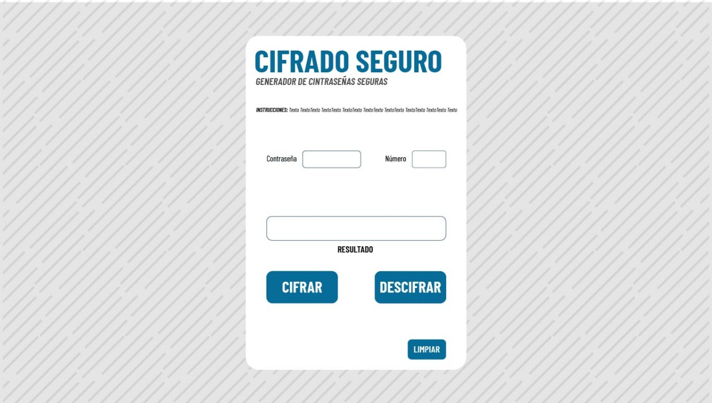
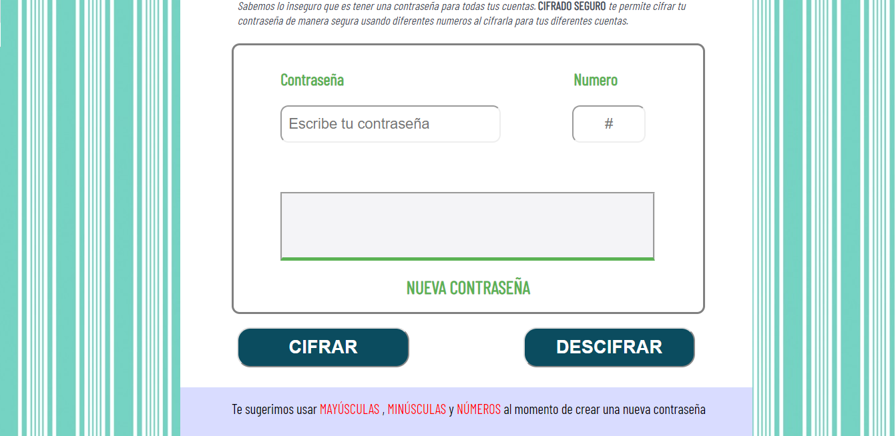
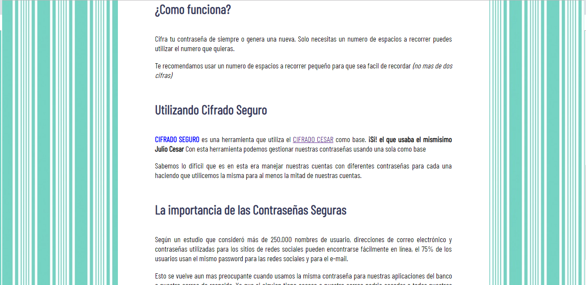
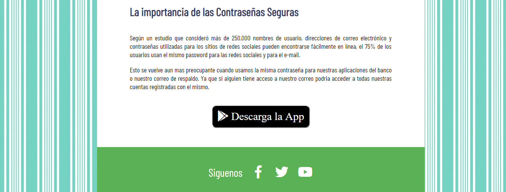

# CIFRADO SEGURO
Cifrado Seguro es un programa que te permite codificar y descodificar mensajes bajo el método [cifrado César](https://marvelapp.com/5803140). Corresponde a una técnica de codificación por sustitución, donde cada letra de un texto es reemplazada por otra letra acorde a un número determinado de posiciones (desplazamiento) en el alfabeto.
Por ejemplo, si usamos un desplazamiento (_offset_) de 3 posiciones:
- La letra A se cifra como D.
- La palabra CASA se cifra como FDVD.
- Alfabeto sin cifrar: A B C D E F G H I J K L M N O P Q R S T U V W X Y Z
- Alfabeto cifrado: D E F G H I J K L M N O P Q R S T U V W X Y Z A B C
## Pre-requisitos e instalación
1. Antes que nada, asegúrate de tener un editor de texto en
   condiciones, algo como [Atom](https://atom.io/),
   [Visual Code](https://code.visualstudio.com/), [Sublime Text](https://www.sublimetext.com) o cualquier otro de tu preferencia.
2. Para ejecutar los comandos a continuación necesitarás una
   [UNIX Shell](https://github.com/Laboratoria/curricula-js/tree/v2.x/topics/shell),
   que es un programita que interpreta líneas de comando (command-line
   interpreter) así como tener [git](https://github.com/Laboratoria/curricula-js/tree/v2.x/topics/scm/01-git)
   instalado. Si usas un sistema operativo "UNIX-like", como GNU/Linux o MacOS,
   ya tienes una _shell_ (terminal) instalada por defecto (y probablemente `git`
   también). Si usas Windows puedes usar [Git bash](https://git-scm.com/download/win),
   aunque recomendaría que consideres probar GNU/Linux como tu Sistema Operativo.
3. Haz tu propio [fork](https://help.github.com/articles/fork-a-repo/)
   de [ este repositorio](https://github.com/ameyallibg/cdmx-2019-01-bc-core-am-cipher) de tu cohort, tus _coaches_ te compartirán un _link_ a un repositorio y te
   darán acceso de lectura en ese repo.
4. [Clona](https://help.github.com/articles/cloning-a-repository/)
   tu _fork_ a tu computadora (copia local).
5. Instala las dependencias del proyecto con el comando `npm
   install`. Esto asume que has instalado [Node.js](https://nodejs.org/) (que
   incluye [npm](https://docs.npmjs.com/)).
6. Si todo ha ido bien, deberías poder ejecutar las :traffic_light:
   pruebas unitarias (unit tests) con el comando `npm run test`.
##Consideraciones técnicas
Este proyecto está desarrollado con:
- EMS6 JavaScriptpuro [JSVanilla](https://medium.com/laboratoria-developers/vanillajs-vs-jquery-31e623bbd46e).
-CSS3
-HTML5
- Se realizaron [pruebas unitarias]() para validar la funcionalidad de codificación y decodificación. Estos test se implementaron con [Mocha](https://mochajs.org/) y assertion library de [Chai](https://www.chaijs.com/).
- Como gestor de proyecto de utilizó NPM (Node Package Manager).
## Pruebas
Las pruebas automatizadas para este sistema requieren de una instalación simple a través del comando npm install. Los tests verifican que regrese una letra acorde a la posición ingresada en el offset. Analiza que la función  cifrar retorne "HIJKLMNOPQRSTUVWXYZABCDEFG" para "ABCDEFGHIJKLMNOPQRSTUVWXYZ" con offset 33; y que la función decifrar retorne retornar "ABCDEFGHIJKLMNOPQRSTUVWXYZ" para "HIJKLMNOPQRSTUVWXYZABCDEFG" con offset 33. No cifra caracteres especiales y espacios (" !@" debería retornar  " !@"', ).
## Autores
-Cristal García
## Expresiones de gratitud
Agradezco el apoyo de mi squad "Guacacoders".  
# UX-UI
Para conocer el proceso de diseño con el que se desarrollo este producto consultar el siguiente link:

## Usuario

### Cliente modelo:

- Giselle Brito tiene mas de 6 cuentas con la misma contraseña, ella ha intentado usar diferentes contraseñas en cadas cuenta pero hoy en dia maneja mas de 12 cuentas diferentes, asi que el recordar 12 contraseñas para cada cuenta le resulta imposible, y se enfrenta a un caso de vulnerabilidad al usar la misma para  6 de sus cuentas, entre ellas las mas importantes como la de su correo, la de su aplicacion del banco, y las contraseñas de sus aplicaciones de compras donde tiene registradas sus tarjetas  de credito y debito.

- Ahora con (_CIFRADO SEGURO_) podra gestionar todas sus cuentas, y no tendra preocupaciones al usar

**Investigacion:** Realizando pequeñas encuentas acerca de que personas tenian una misma contraseña para mas de tres cuentas, me di cuenta que mi sector del mercado son los adultos-jovenes de entre 18-30 años, los que generalmente comparten la misma contraseña con sus cuentas como su email y sus redes sociales.

##UX/UI
El usuario puede ingresar su contraseña de siempre o generar una nueva, le recomendamos que su contraseña tenga MAYÚSCULAS, MINÚSCULAS y NUMEROS.

**Boceto**
Al saber que la pagina tendria pocos objetos que manipular se decidio centrar todo el contenido, y asi hacerlo mas amigable para el usuario.

El concepto inicial de la pagina cambio junto con el proceso.
No sin antes recordar

 Se penso hacer todo con bordes redondeados para hacerlo mas amigable para el usuario.

 tiene un diseño minimalista.

 En base a las encuentas pareciera mas una app que una pagina web.

 Se tomaron en cuenta esas consideraciones y el diseño final , ofrece en primera plano al abrir la pagina  el titulo y la caja donde se cifra asi como un pequeño resumen de como funciona.

cuando haces scroll nos muestra  los botones de cifrar y descrifrar asi como instrucciones adicionales de usar mayusculas y minusculas asi como numeros.

